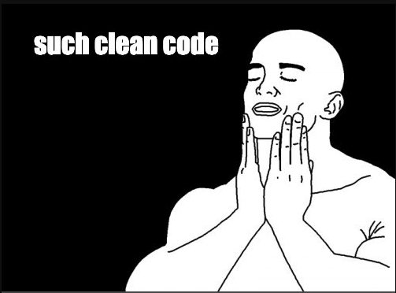
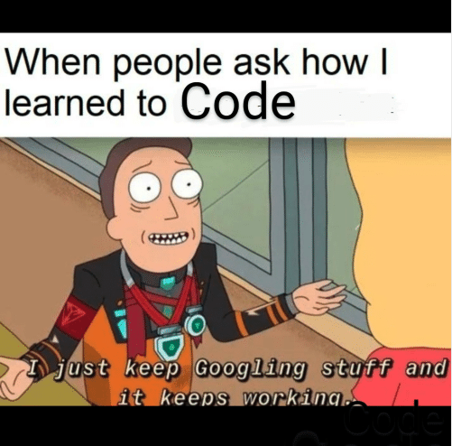
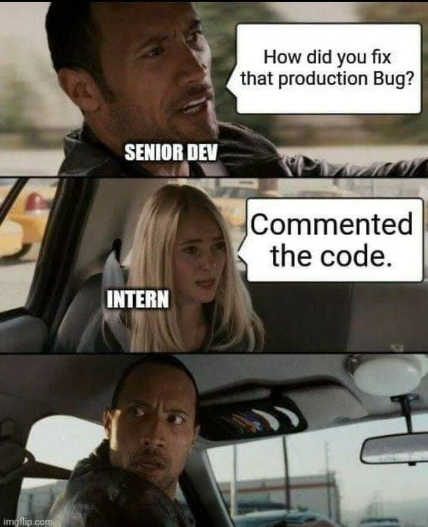
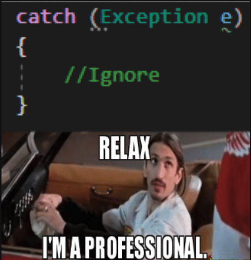

# How to write clean code?
I think there is not once in programmers' life that we have not wondered how to make our code clean and organized. Or felt like me when you saw some awesome opensource projects on GitHub and felt like:



Writing clean and organized code is not challenging if you start early. You should never create an excuse to write organized and clean codes. Saying I will try to write clean code later is like a cracked screen protector in your phone, which you know you need to change but never gives an effort to go and change it.

These are some of the techniques I myself follow to write better codes. Regardless of any programming language, you can easily use these steps to make your code clean and organized.

### 1. Stop copy pasting code blindly from online websites.



Yes, you heard it right, though there is barely anyone who till now hasn't used code from online sites especially from stack overflow. It isn't bad to copy and paste code from online sites but you should know what you're doing before copying from other sources. If the copied code solves your issue or you got desired output, that doesn't mean the code you're copying is the right one. First, you will have to check if it brings any kind of vulnerability or not. How many extra dependencies it brings with it. If it requires any extra dependency package that may have some kind of vulnerability. You have to make sure that the code doesn't bring any kind of typos or bugs with them. Copying spaghetti code will bring extra complexity to your codebase. So you have to think twice or any required time before copying codes from google.

---

### 2. Follow Proper Naming rules
While naming a variable or function always keep in mind the purpose of it and use descriptive and unambiguous names. For example:
```js
// bad practice
let a = 25;

// good practice
let age = 25;

// bad practice
const getData = () => Promise.resolve([{id: 1, name: 'hello world'}]);

// good practice
const getUser = () => Promise.resolve([{id: 1, name: 'hello world'}]);

// bad practice
for (let i = 0; i <= 20; i++) {
	// do some thing
}

// good practice
const TotalStudents = 20;
for (let i = 0; i <= TotalStudents; i++) {
	// do some thing
}

```
Choosing the right name can make it much better to understand its intent. If it serves the purpose don't hesitate if the expressive name becomes too long. For naming purposes be sure to follow either *camel case* or *snake case* . Never use magic numbers but rather try making those constants.
In the case of a class name, it should avoid using a verb and uses a noun.
```js
// bad practice
class Info {
	// ...
}

// good practice
class Profile {
	// ...
}

```

---

### 3. Function rules
* Always try to make it small. Don't make it a monolith. If you can break it into separate reusable chunks you should always do it.
* Make function arguments as few as possible.
```ts
// bad practice
const search = (keywords, limit, page) => Promise.resolve([]);

// good practice
interface SearchFilterInterface {
  keywords: string;
  limit: number;
  page: number;
}

const searchUsers = (filters: SearchFilterInterface) => Promise.resolve([]);
```
* Make sure the function arguments data type is always of the same type. Don't let the user pass boolean where the string is needed.
* Make your function in a way that it always returns a consistent type. Your function should not return different data types in any case.

---

### 4. Use lint checks
Most of the popular programming languages have lint checkers available in the popular IDE they use. You can also configure lint on your specific projects. These lints helps to avoid some minor mistakes like variable, class, method naming, code duplicates, indentation error, etc. beforehand. Be sure to set up the project in a way that when you push your code to GitHub repo it always checks if there are any lint errors in your code.

---

### 5. Comment
This is one of the essential virtue a programmer should have. Always try to comment on your codes explaining the intent of your code. You should avoid commenting out the code and leaving it. It's better to just remove it. Since nowadays everybody uses git, you can easily view history and revert your code if you need it again. You should not add an unnecessary comment that doesn't serve any purpose. Don't make your comment redundant and obviously don't be a person like below.



---

### 6. Follow detail code structure
It doesn't matter how small the project is, always organize your code in the proper concerned folder and subfolder. Do not write multiple domain codes in the same files. Try to organize it per its purpose. Don't make your code structure spaghetti. Make it easily searchable and easy to go through.

---

### 7. Follow coding pattern
* DRY
DRY stands for "Don't Repeat Yourself". As the name states, it discourages the repetition of code.
If we repeat code in our projects if anything changes we will have to make changes in all places.

* KISS
KISS stands for "Keep It Simple, Stupid". The simpler your code is it will be easier to maintain it or to be understood by your other team members. After all programming language is to be understood by us humans more because computers can understand only 0 and 1. Don't bring unnecessary complexity to your codes. Never write a code that will leave you scratching your head when you check it after a month.

*YAGNI
YAGNI stands for "You Aren't Gonna Need It". Sometimes we developer tends to think ahead of thing and write code extra features thinking we may need it on future. You should always focus on your existing feature rather than worrying about some imaginary complex feature that may or may not be needed and could be removed or changed. 

* SOC
SOC stands for "Separation of Concerns". This principle states to separate responsibility of a single class to this class and this class only. The best practice is to write code in a way so that each class or section will address its own concern.

---

### 8. Error Handling
Error handling is a vital part of programming. You should never be lazy to handle errors.  If you have implemented proper error handling, your code will continue to function without crashing. An unhandled error can cause your program to crash, end-user to lose their work, and if it supports stack trace error it can even release some vital information related to your projects or servers. Be sure to avoid the below behavior.



---

### 9. Testing
Make sure to write tests for your code. Writing tests for code will reduce the maximum chance to have error codes in your deployment environment. Keep on assert per test. While creating a function or class, make sure to make it mockable and avoid unwanted and unused dependency which will make it hard to write test cases for it. The test should be independent and fast too.

---

### 10. Increase networking
The best way to learn clean codes is to try to communicate with your team members and review each other codes and suggest to them what can be done to make them more optimized, efficient, and organized. You should be always ready to take positive criticism from others. You should also have a learning and teamwork mentality because


---

Besides the above steps, you can also further improve your code quality by self-reviewing your own code by making sure you follow the above points. Always revisit your code and check if you can optimize it furthermore. Ask your other team members to review your codes and as feedback from them. Since you will never want to get hurtful comments from others be sure to give positive feedback to your teammates when you're reviewing their codes. Rather than going line by line to check minor errors be sure to use lint checkers to automate those processes.

If you want to discuss more about it be sure to mail me at:
[Roshan Ranabhat](mailto:roshanranabhat11@gmail.com?subject=[GitHub]%20Source%20Han%20Sans)

